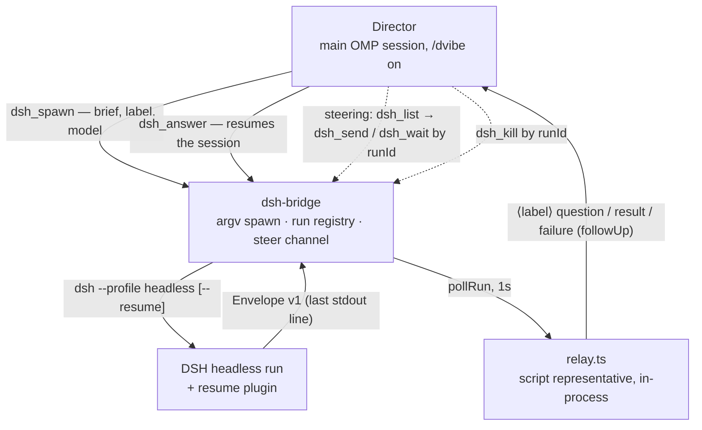

# omp-dsh-workers

[](https://github.com/ask33r/omp-dsh-workers/actions/workflows/test.yml)

Run DeepSeek Harness (DSH) workers from your [oh-my-pi](https://github.com/can1357/oh-my-pi) session. The session becomes the **director**: it hands out briefs with `dsh_spawn`, each worker runs as a persistent `dsh --profile headless` session, and worker questions and results return as native messages relayed by a script.

Experimental **v0.1**: the interfaces are frozen in `docs/contracts/`, but nothing here has been through a public release cycle yet.

## Why

The OMP harness is expensive per task, and a native sub-agent pays that cost on every job. Here it is paid once at the director level; the work runs in DSH, fast and token-frugal, with only a script between them: zero model tokens per task. DSH makes runs persistent (`--resume` on a real session id). When you do not need DSH, native sub-agents are still the right choice.

## How it works

Two model levels, deliberately separate:

| Level | Who | Model comes from |
|---|---|---|
| 1 | **Director** — your main OMP session in `/dvibe` mode | your OMP session model |
| 2 | **DSH executor** — one DSH headless process per run | `model` of `dsh_spawn`, else the `@dsh` role, else your session's model, else DSH's default |

So `@dsh` names the executor's inherited model when `dsh_spawn` has no `model` — the watcher is code, not a model.



The director spawns with `dsh_spawn`, answers with `dsh_answer`, steers with `dsh_send`, waits with `dsh_wait` and cancels with `dsh_kill`; `dsh_list` resolves a label to a runId.

## Components

| Path | What it is |
|---|---|
| `extensions/dsh-task/` | The OMP extension: `dsh_task`, `dsh_spawn`, `dsh_answer`, `dsh_wait`, `dsh_kill`, `dsh_send`, `dsh_list`, the relay script (`relay.ts`), `/dvibe`, an orphan watchdog. |
| `tools/dsh-bridge/` | bridge-core: spawn in its own detached process group, run registry, Envelope v1, steer channel, owner lease and reaping. Node ≥ 22, no runtime dependencies. |
| `plugins/dsh-headless-resume/` | Cordis plugin in DSH's headless profile: adds `--resume`, prints Envelope v1, runs model preflight, reads the steer channel. |
| `scripts/` | Installation: symlinks into the live OMP dir, the DSH profile patch, plugin dependency linking. |

## Requirements

- **oh-my-pi v18** — verified against 18.0.3 / 18.0.4; `@oh-my-pi/*` pinned at `^18.0.4`.
- **DSH ≥ 0.1.1-rc.2** on `PATH`, with the `headless` profile present.
- **bun** for the test scripts; **Node ≥ 22** for bridge-core.
- A model provider configured in your DSH settings; the extension is provider-neutral: it passes a `<provider>/<model>[:<effort>]` string to DSH.

**DSH is at release-candidate stage.** The resume plugin attaches by *entry id*, so a release renaming those ids makes the patch silently stop applying. After every DSH upgrade re-run `dsh --profile headless --help`: if `--resume` is gone, the plugin is not mounted; `docs/dsh-update-checklist.md` has the full checklist.

## Install

The repository is the source of truth; live directories only ever receive **symlinks** back into it.

**1. Link the extension into OMP.**

```sh
scripts/install-omp-links.sh [--dry-run] [--uninstall] [--omp-dir DIR]
```

Creates a symlink `extensions/dsh-task` under `$OMP_DIR` (default `$HOME/.omp/agent`). Idempotent — a same-source link is left alone, one pointing elsewhere is re-pointed, and a **real file** at the destination aborts the script. `--uninstall` removes only links that point here.

**2. Mount the resume plugin into the DSH headless profile.**

```sh
scripts/install-resume-plugin.sh              # install
scripts/install-resume-plugin.sh --uninstall  # remove
```

Backs up before every change; requires `dsh` on `PATH` and `${DSH_HOME:-$HOME/.dsh}/profiles/headless`. Then:

- Symlinks `@deepseek-ai` and `commander` from `$DSH_MODULES` into the plugin's `node_modules`.
- Adds the plugin: `dsh plugin --profile headless add link:<plugin dir>`, after backing up `package.json`.
- Appends a `cordis.patch.yml` block that disables `headless-startup` / `headless-runner` and inserts `headless-resume-startup` / `headless-resume-runner`.
- Verifies: success only when `dsh --profile headless --help` mentions `--resume`.

**3. (tests only)** `scripts/link-plugin-deps.sh` links dependencies on its own; `bun run test:resume` calls it.

## Usage

### Director mode

- `/dvibe` toggles director mode; `/dvibe on` / `/dvibe off` are explicit. The model can also switch it via the `dvibe` **tool** (`action: "on" | "off"`), which stays in the narrowed toolset.
- While on, the toolset narrows to `read`, `todo`, `dsh_spawn`, `dsh_answer`, `dsh_send`, `dsh_wait`, `dsh_list`, `dsh_kill`, `dvibe`, plus a director directive appended to the system prompt. The `dvibe` tool returns that directive in its result: the model calls it after `before_agent_start` has run, so the turn prompt cannot carry the rules.
- Briefs go into `dsh_spawn` verbatim. Worker questions arrive as `⟨label⟩` messages from `relay.ts`, answered with `dsh_answer`; results arrive the same way.
- Delivery is at-least-once: an event is re-announced every 120 s until a matching `message_start` proves the followUp entered the turn context; max 3 attempts per event. A delivered `need_input` stays watched until `dsh_answer`.
- Finished handing out work? End the turn: events arrive as messages on their own.
- `dsh_wait` is the synchronous alternative, only when the next step blocks on that specific run and nothing is left to hand out; an envelope read this way never arrives twice.
- On `/dvibe off`, shutdown, or an in-process session switch the previous toolset is restored.

### Briefs, models, resume

- Give each task a short `label` and, optionally, a `model`, both as `dsh_spawn` parameters; the label finds the run later in `dsh_list`, `dsh_answer`, `dsh_send`.
- Model notation is `<provider>/<model>[:<effort>]`; effort levels: `off`, `minimal`, `low`, `medium`, `high`, `xhigh`, `max`. The suffix after the last `:` counts as effort only if it is one of them, else the colon belongs to the model name. No whitespace or control characters; provider/model ≤ 200 chars each, spec ≤ 512; malformed spec fails before spawning: `error [invalid_model]`.
- Without `model`, the run inherits the `@dsh` role from OMP (`modelRoles.dsh`), falls back to your session's model, then to DSH's own default.
- Resume: pass `resumeFromRunId`; the bridge looks up its `sessionId`. Do **not** put a `runId` into `resumeSessionId`: different identifiers, you get `resume_not_found`.
- Resume works once the run has left an envelope on disk; without one `dsh_spawn` throws `has no session to resume` — for a run still running as well as one gone (killed early, crashed at startup, swept). Check which before reacting: a new brief for a still-working run duplicates work.
- The model override is **not sticky**: a resume without `model` recomputes the model. `dsh_answer` has no `model` parameter at all; to continue on another model use `dsh_spawn` with `resumeFromRunId` and an explicit `model`.

### What the director sees

Tool cards render for humans, separately from the text the model receives: `▶ dsh spawn → <label>`, `✓ started <label> (<runId8>) · pid …`, then `⏳ still running` with last output lines or `✓ completed · model: … · session: …` plus first result lines. While runs are tracked, a `dsh runs` board sits above the editor and the footer shows `dsh: N running · M done`. The tools' text output is unchanged: it remains the contract.

### Tools

| Tool | Parameters | Text the caller gets |
|---|---|---|
| `dsh_spawn` | `task`, `label?`, `model?`, `timeoutMs?`, `resumeFromRunId?`, `resumeSessionId?` | `started <runId> (pid <pid>)`, plus ` label=…` and ` model=…` when given |
| `dsh_answer` | `runId` / `label` (at least one; with both, `runId` picks the target run, `label` names the new run), plus `answer` | `answered <oldRunId> -> <newRunId>` |
| `dsh_wait` | `runId`, `waitMs?` (default 30000; `0` = single poll) | the run's result, or `still running: <runId>`, or `wait cancelled for <runId>; run still active` |
| `dsh_send` | `runId`, `text` | `sent to <runId>` / `pending: …` / `NOT delivered: run ended before reading; message lost` |
| `dsh_kill` | `runId` | `kill <runId>: killed (…)` or `kill <runId>: not killed (…)` |
| `dsh_list` | — | `no active runs`, or one line per run |
| `dsh_task` | `task`, `model?`, `timeoutMs?`, `resumeFromRunId?`, `resumeSessionId?` | the run's result (blocking, one-shot) |

`dsh_wait` timing out is normal: the run stays alive and can be waited on again; aborting a wait never stops the run. `pending` from `dsh_send` means the write reached the channel and the run was alive on re-check — not confirmed delivery; wait instead of resending. `dsh_task` leaves no envelope, so its run cannot be continued; chains go through `dsh_spawn`.

### Lines the director can rely on

These lines go into the tool's *text* output, not only `details`, so a director reading plain text can verify executor, continuity and error codes:

```
model: <provider>/<model>[:<effort>]
session: <sessionId>
error [<code>]: <message>

# and one line per run from dsh_list:
<runId> state=<state> label=<label|-> model=<spec|default> started=<ISO-8601>
```

## Error codes

Every failure returns as an explicit error turn with an envelope code, never a partial success.

| Envelope code | Meaning |
|---|---|
| `spawn_failed` | The DSH binary did not start. |
| `nonzero_exit` | The run finished with a failure exit code. |
| `timeout` | The run did not finish within its deadline. |
| `killed` | The run was cancelled. |
| `malformed_output` | DSH did not return a valid Envelope v1. |
| `resume_not_found` | There is no such session to resume. |
| `resume_corrupt` | The persisted session is corrupt or unsupported. |
| `resume_busy` | The session is already live, or its persisted preparation is reserved. |
| `owner_gone` | Nobody renewed the run's lease; the watchdog reclaimed it. |
| `deadline_exceeded` | The run outlived its deadline and was reaped. |
| `model_not_found` | The provider/model is not in DSH's catalog. |
| `invalid_model` | The model exists, but the effort or metadata does not fit it. |

Defaults: run deadline 30 min; owner lease 5 min, renewed by each `dsh_wait` window.

## Tests

```sh
bun run test          # unit + integration + bridge = 366 tests, no installed DSH needed
bun run test:resume   # resume plugin — needs an installed DSH
```

Verified counts on this tree: 195 unit + 11 integration + 160 bridge = **366 tests**, passing without an installed DSH. Unit mocks bridge-core; integration and bridge run against a fake `dsh` binary injected through `DSH_BINARY`. CI runs the same three suites with a clean `HOME`, after `typecheck`, `lint`, `format:check` (strict tsc, Biome). `test:resume` imports `@deepseek-ai/*` at runtime — DSH must be installed.

## Limitations

- **Orphans are swept, not prevented.** DSH runs outlive the OMP session; sweeping happens on load and every 30 s. On clean `session_shutdown` the extension kills its own runs (`SIGTERM` synchronous, `SIGKILL` best-effort) without clearing the registry.
- **No in-flight crash recovery**: a mid-turn death is not restored; only the DSH *session* can be resumed.
- **Compaction on resume reads the previous run's header** until the first new request header is written.
- **`model` in the envelope is best-effort**: last prepared request config, not proof of dispatch.
- **Model override is per run**, not inherited across `resumeFromRunId`.
- **Hub metrics do not see DSH tokens.**

## Status, history, license

Experimental **v0.1** (`0.1.0`). Interface contracts live in `docs/contracts/`; `docs/dsh-update-checklist.md` covers DSH upgrades. Everything a user or a model reads is English; in-code comments and test names are Russian. [MIT License](LICENSE).
